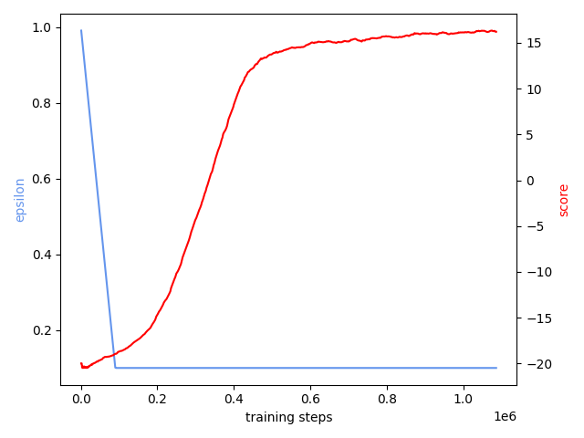
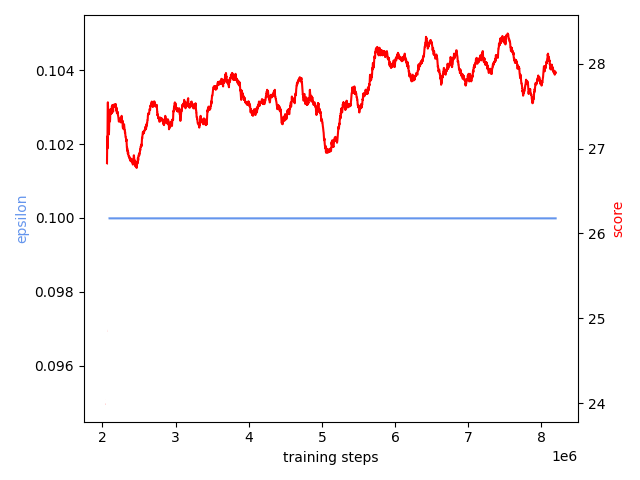

## Atari, Deep Reinforcement Learning

### General
Implementation of Deep Q Learning agent (DQN) & Double Deep Q Learning agent (DDQN). \
The agents were trained on two distinct games, which both share a common action space,\
but differ in complexity of environment. The agent was trained on Pong & Freeway.  

The project was developed for course: `Artificial Intelligence (Master's degree, FRI 2022)`. \
Note that main purpose of this project was evaluation & exploration of model performance, therefore some solutions are ad-hoc.

### Requirements
In order to run the code, reader must first install the following dependencies.
`pip install torch` \
`pip install torchvision` \
`pip install numpy` \
`pip install matplotlib` \
`pip install gym` \
`pip install box2d-py` \
`pip install atari-py` \
`pip install pygame` \
`pip install cv2` \
`pip install ale-py`

### Usage
Evaluate pong agent & plot distribution of actions \
`python -u main.py -memSize=50000 -mode=eval -loadModel=1 -path=models/ -actionHist=1 -numEpisodes=5 -env=PongNoFrameskip-v4` \
Evaluate freeway agent & plot ditribution of actions \
`python -u main.py -memSize=50000 -mode=eval -loadModel=1 -path=models/ -actionHist=1 -numEpisodes=5 -algo=DDQN -env=FreewayNoFrameskip-v4\
Train DDQN Agent on freeway \
`python -u main.py -memSize=50000 -path=models/ -algo=DDQN -env=FreewayNoFrameskip-v4`
### Documentation
Brief explanation of the project is available in `paper.pdf`.

CLI arguments:
```    
  python main.py <args>
    -numEpisodes default=500  Number of episodes to play
    -learnRate default=0.0001 Model learning rate
    -epsMax default=1.00 Maximum value of epsilon in epsilon greedy method
    -epsMin default=0.1  Minimum value of epsilon in epsilon greedy method
    -epsDec default=1e-5 Decrement value of epsilon in epsilon greedy method
    -gamma default=0.99  Discount factor for update Q equation
    -memSize default=50000 Replay memory buffer size
    -batchSize default=32 Replay memory sample batch size
    -replaceInterval default=1000 Target network replace weights interval
    -env default=PongNoFrameskip-v4 Atari environment
    -loadModel default=False Load model checkpoint
    -path default=models/ Path for model saving/loading.
    -evalName default=datetime.now().strftime("%H:%M:%S"), ="Model evaluation name.")
    -gpu default=0 GPU: 0 or 1
    -algo default=DQN DQN/DDQN/RANDOM
    -mode default=train train/eval
    -actionHist default=False Keep track of agents action selection
    -logging default=False Log performance into a file
```

### Report
Thorough report of project is available: `report/report.pdf` \

### Results
See report for detail
#### Pong
<figure>

<figcaption>DQN Agent performance after 500 episodes.</figcaption>
</figure>

<figure>

<figcaption>DDQN Agent performance after 500 episodes.</figcaption>
</figure>

#### Freeway
<figure>

<figcaption>DDQN Agent performance after 1000 episodes.</figcaption>
</figure>

<figure>

<figcaption>DDQN Agent performance after 8000 episodes.</figcaption>
</figure>

#### Evaluation
Table 1. shows average score over 10 episodes for all agents (epsilon = 0.01). \
DQN denotes a DQN agent trained for 1 million steps in case of pong \& 2 million steps in case of freeway. \
DDQN denotes a DDQN agent trained for 2million steps in case of pong \& 2 million steps in case of freeway. \
DDQN_8 denotes a DDQN agent trained for 8 million steps. \
NAIVE denotes agent which always selects forward action in freeway.  

| Game    | DQN  | DDQN | DDQN_8 | NAIVE | RANDOM |
|---------|------|------|--------|--------|---------|
| Pong    | 20.8 | 20.8 | /      | /      | -21.0   |
| Freeway | todo | 31.5 | 32.5   | 21.2   | 0       |
>>>>>>> 1152f6aa1aab1ab42f3b4e5df4ee6f3bbf8ba1d3
